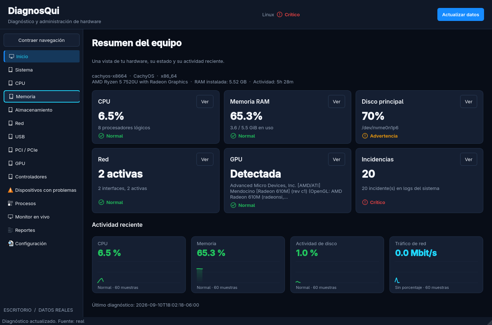

# DiagnosQui

Diagnóstico de hardware para Windows y Linux con dos interfaces independientes: **escritorio nativo PySide6 con proveedores reales** y **terminal con diagnósticos de prueba (fixtures)**. Ambos monitores obtienen procesos y métricas reales mediante `psutil`.

La terminal conserva el arranque inspirado en `npm install`, el banner de `pyfiglet`, las tablas Rich, el prompt con historial y el monitor Textual. El escritorio funciona en una ventana propia, con navegación lateral, tarjetas, tablas y gráficas.



## Instalación

Requiere Python 3.9 o posterior. Desde la raíz del repositorio, crea y activa un entorno virtual e instala el paquete:

```bash
python -m venv .venv
```

Linux:

```bash
source .venv/bin/activate
python -m pip install -e .
```

Windows (PowerShell):

```powershell
.\.venv\Scripts\Activate.ps1
python -m pip install -e .
```

La instalación incluye `PySide6>=6.7`, `rich`, `prompt_toolkit`, `pyfiglet`, `textual` y `psutil`. Las gráficas usan `QPainter`, sin dependencias adicionales. En Windows instala también los extras existentes para los proveedores reales:

```powershell
python -m pip install -e ".[windows]"
```

Linux necesita un entorno gráfico y las bibliotecas del sistema requeridas por Qt. pip selecciona versiones compatibles con el Python y la plataforma instalados.

También puedes ejecutar `bash install.sh` o `.\install.ps1`. Resuelven el paquete desde la ubicación del script, aunque se invoquen desde otra carpeta. Crean el entorno `~/.diagnosqui-venv` (Windows: `%USERPROFILE%\.diagnosqui-venv`); `DIAGNOSQUI_VENV` permite cambiarlo. En Linux se puede solicitar sudo para registrar los lanzadores en `/usr/local/bin`; el instalador imprime también las rutas para ejecutarlos directamente.

## Inicio del escritorio

Con el entorno virtual activado:

```bash
diagnosqui-gui
```

En Linux, para separar el proceso de la terminal que lo inicia:

```bash
diagnosqui-gui --detach
```

En Windows, los lanzadores gráficos se instalan como `gui-scripts`. Puedes iniciar el ejecutable sin abrir una consola:

```powershell
Start-Process .\.venv\Scripts\DiagnosQui-Escritorio.exe
```

`--detach` crea un proceso independiente; no convierte la aplicación en un servicio ni la mantiene abierta al cerrar la sesión del escritorio. Para depurar el inicio usa `python -m diagnosqui.gui_cli` sin esa opción.

La ventana conserva el marco nativo y permite contraer la navegación. Incluye Inicio, Sistema, CPU, Memoria, Almacenamiento, Red, USB, PCI / PCIe, GPU, Controladores, Dispositivos con problemas, Procesos, Monitor en vivo, Reportes y Configuración. Puedes usar Tab para recorrer controles, Enter/Espacio para activarlos, F5 para actualizar y Ctrl+1 para volver al inicio.

- **Inicio:** identidad del equipo, seis tarjetas y cuatro gráficas. Las tarjetas abren sus diagnósticos. La ocupación del disco principal corresponde a la partición del sistema, cuando está disponible.
- **Diagnósticos:** evidencia, estado, detalles estructurados, recomendaciones, fecha, carga y errores. Cada componente puede consultarse por separado.
- **Procesos:** búsqueda, ordenamiento numérico por encabezados, accesos para ordenar por CPU/memoria y pausa. CPU se normaliza respecto al total de núcleos. No hay acciones para terminar procesos.
- **Monitor:** CPU, RAM, actividad de disco y tráfico de red; hasta 60 muestras por gráfica. Verde <70%, amarillo ≥70%, rojo ≥90%; cian cuando no existe porcentaje medible. Identifica el disco o interfaz más activo cuando es posible. La medición puntual de E/S reutiliza `core.io_monitor`.
- **Problemas:** críticos primero, después advertencias y normales; detalle seleccionable y estado vacío cuando no hay incidencias.
- **Reportes:** diagnóstico completo, resumen, carpeta mediante diálogo y exportación JSON, CSV y HTML. Se exporta la instantánea mostrada sin repetir consultas. Los archivos identifican su fuente y tienen nombres únicos. Un botón abre la carpeta de destino.
- **Configuración:** intervalo de 1–30 segundos, animaciones, carpeta de reportes y confirmación de cierre, guardados por usuario mediante `QSettings`.

El temporizador programa lecturas en pools de hilos reutilizables. Los diagnósticos, procesos, métricas y exportaciones se ejecutan fuera del hilo gráfico. Al cerrar se detienen las actualizaciones y se espera la lectura en curso, informando de ello sin bloquear el bucle de eventos.

## Uso de la terminal

```bash
diagnosqui
diagnosqui --setup
diagnosqui --command cpu
diagnosqui --report
diagnosqui --export-html
diagnosqui --command exportar --output-dir ./mis-reportes
```

El primer inicio interactivo muestra la animación de preparación y el banner. `--setup` permite repetirla. La secuencia de paquetes es una simulación visual: no ejecuta npm ni instala dependencias de hardware.

`--command` ejecuta una opción sin entrar en el prompt; acepta el nombre o el número del menú. `--report` muestra el reporte de prueba. La opción `exportar` (`15`) guarda JSON y `--export-html` genera HTML y CSV. Los archivos se guardan en `./reportes` por defecto; `--output-dir` permite elegir otra carpeta y también se aplica a las exportaciones de la sesión interactiva. Los archivos exportados se identifican como datos de prueba.

El prompt permite recuperar comandos con las flechas arriba/abajo y autocompletarlos con Tab. El historial y la marca de primer inicio usan un directorio de estado por usuario; la variable de entorno `DIAGNOSQUI_STATE_DIR` permite elegir otra ubicación, útil para pruebas o instalaciones portables.

| Número | Comando | Acción |
|---|---|---|
| 1 | `general` | Diagnóstico general |
| 2 | `cpu` | Diagnóstico CPU |
| 3 | `memoria` | Diagnóstico memoria RAM |
| 4 | `pci` | Diagnóstico PCI / PCIe |
| 5 | `red` | Diagnóstico de red |
| 6 | `usb` | Diagnóstico USB |
| 7 | `disco` | Diagnóstico de almacenamiento |
| 8 | `gpu` | Diagnóstico GPU / vídeo |
| 9 | `controladores` | Diagnóstico de controladores |
| 10 | `problemas` | Dispositivos con problemas |
| 11 | `conectividad` | Pruebas de conectividad |
| 12 | `monitor` | Monitorización del sistema con datos reales |
| 13 | `recomendaciones` | Recomendaciones de solución |
| 14 | `reporte` | Mostrar reporte de prueba |
| 15 | `exportar` | Exportar diagnóstico de prueba a JSON |
| 16 | `optimizacion` | Optimización de Windows (creados con confirmación y log); solo visible en Windows |
| 17 o 0 | `salir` | Cerrar DiagnosQui |
| — | `help` | Mostrar menú y ayuda |
| — | `clear` | Limpiar la terminal |
| — | `setup` | Repetir la animación de inicio |

La opción 16 ejecuta el módulo real de optimización solo en Windows: verifica
Administrador, muestra un resumen de temporales y el estado de los servicios de
telemetría, pide confirmación `s/n` por acción y registra cada cambio en
`logs/optimizacion.log`. Todo es reversible y nada se ejecuta sin confirmación.
En Linux conserva un aviso de "Optimización disponible solo en Windows". Se
conserva `17` para salir en ambas plataformas; `0` también funciona como alias.

Cada resultado se muestra como una tabla de una fila: **Componente · Evidencia · Estado · Recomendación**. Se muestra la primera línea de la primera recomendación. Los estados usan verde/cian para `NORMAL`, amarillo para `ADVERTENCIA` y rojo para `CRITICO`.

## Monitor de terminal

Escribe `monitor` o `12` para abrir la aplicación Textual. Las dos pestañas se actualizan cada segundo:

- **Procesos:** PID, nombre, CPU% y memoria% de procesos reales. Pulsa `c` para ordenar por CPU o `m` para ordenar por memoria; los encabezados correspondientes también permiten ordenar.
- **Rendimiento:** gráficas sparkline de CPU, memoria, disco y red, con sus valores actuales encima. Los porcentajes usan verde por debajo de 70%, amarillo desde 70% y rojo desde 90%.

Pulsa `q` o Esc para cerrar el monitor y regresar al menú. El monitor está pensado para una terminal interactiva.

La CPU de cada proceso se expresa respecto al total de núcleos del sistema. Disco y red muestran el dispositivo o la interfaz más activa para evitar sumar tráfico duplicado. Si el sistema no expone el tiempo activo del disco, se muestra su tasa de E/S en MiB/s; la red muestra Mbit/s y calcula utilización solo cuando conoce la velocidad del enlace. Los valores sin porcentaje medible se muestran en cian. Las gráficas conservan los últimos 60 puntos y ajustan su escala; en terminales pequeñas se puede desplazar la pestaña Rendimiento.

## Integración de módulos

El paquete instalable está en `diagnosqui/src/diagnosqui/`. La terminal se concentra en `cli.py` y `ui/{theme,boot,terminal,monitor_tui}.py`; su punto de entrada es `diagnosqui.cli:main`. El escritorio tiene la entrada independiente `diagnosqui.gui_cli:main`.

`diagnostic_provider(command)` en `cli.py` es el punto de conexión para sustituir los datos de prueba por los módulos reales. Por ahora los comandos `general` (`1`) y `recomendaciones` (`13`) pasan por el motor de reglas de `analisis/` (umbrales 70/90, regla PnP y recomendaciones por dominio) sobre los datos de los fixtures, sin consultar hardware; el resto llama a `terminal.get_fixture_results(command)`. El proveedor se inyecta en la terminal mediante el argumento `fixture_provider`. Cada resultado conserva este contrato; la interfaz de diagnósticos no depende de `core`, `analisis` ni `optimizacion`:

```json
{
  "componente": "CPU",
  "evidencia": "42%",
  "valor_numerico": 42,
  "estado": "NORMAL",
  "detalle": {},
  "recomendacion": ["No se requieren acciones."]
}
```

Los estados admitidos son `NORMAL`, `ADVERTENCIA` y `CRITICO`. Al conectar un proveedor real, debe conservar estas claves para reutilizar las tablas, recomendaciones y reportes.

## Arquitectura gráfica y empaquetado

```text
diagnosqui/src/diagnosqui/
├── gui_cli.py                  # Lanzador gráfico y --detach
├── gui/
│   ├── app.py                  # QApplication, identidad y tema
│   ├── main_window.py          # Ventana, navegación y cierre
│   ├── controller.py           # Coordinación de páginas y tareas
│   ├── workers.py              # QRunnable, señales y QThreadPool
│   ├── theme.py                # Estados y paleta
│   ├── services/               # Contratos, proveedores y telemetría
│   ├── pages/                  # Diagnósticos, procesos, reportes…
│   ├── widgets/                # Tarjetas, tablas, iconos y gráficas
│   └── styles/dark.qss         # Tema incluido en el paquete
├── core/telemetry.py           # Muestreador compartido con Textual
├── core/report_exports.py      # Adaptador de contratos para reportes
├── analisis/                   # Motor de reglas y recomendaciones (puro)
│   ├── reglas.py               # Umbrales 70/90 y regla PnP
│   ├── recomendaciones.py      # Analizadores por dominio y analizar_contrato
│   └── general.py              # Semáforo y JSON general
├── optimizacion/               # Optimización de Windows (opción 16)
│   ├── safety.py               # Administrador, confirmaciones y log auditable
│   ├── temporales.py           # Escaneo y limpieza con dry-run
│   ├── telemetria.py           # Acciones reversibles de telemetría
│   └── menu_optimizacion.py    # Flujo interactivo
├── cli.py                     # Terminal conservada
└── ui/                        # Rich, prompt_toolkit y Textual
```

Además: `build_exe.spec`/`build_bin.spec` (PyInstaller) y `assets/icon.ico`
generado por `tools/make_icon.py`. Empaquetado y comandos en
[docs/empaquetado.md](docs/empaquetado.md).

`DiagnosticService` consume `recolectar_*()` de sistema, cpu, memoria, discos, red, usb, pci, controladores, problemas y monitor (GPU). Nunca llama `show_*()` para presentar datos gráficos. Adapta los metadatos de sistema al contrato y convierte excepciones en resultados parciales con advertencia. Las claves ausentes usan `N/D`, `None`, listas o diccionarios vacíos; un error de lectura no se presenta como una medición de cero.

El **`pyproject.toml` de la raíz es el canónico**: descubre paquetes en `diagnosqui/src/` y es el utilizado por los instaladores y los comandos de este README. `diagnosqui/pyproject.toml` permite instalar desde esa subcarpeta (`pip install -e ./diagnosqui`) y descubre `src/`. Ambos se conservan y declaran las mismas dependencias, extras, versión, entry points y recurso QSS. La terminal permanece en `project.scripts`; `diagnosqui-gui` y `DiagnosQui-Escritorio` están en `project.gui-scripts`.

El muestreador anteriormente contenido en `ui/monitor_tui.py` se extrajo a `core/telemetry.py` y se reutiliza en ambos monitores. Los símbolos públicos originales siguen importables desde `ui.monitor_tui`. La exportación gráfica reutiliza los generadores de `core.reporte`; el HTML escapa los textos recibidos del hardware.

El alias gráfico se llama **`DiagnosQui-Escritorio`**, en lugar del `DiagnosQui` propuesto: Windows normalmente no distingue mayúsculas en nombres de archivos, por lo que `DiagnosQui.exe` sobrescribiría el lanzador de terminal `diagnosqui.exe`. Los nombres distintos preservan ambos modos también al instalar con pip. `diagnosqui-gui` sigue siendo el comando gráfico principal.

## Pruebas y compatibilidad

Desde la raíz, después de instalar el paquete:

```bash
QT_QPA_PLATFORM=offscreen python -m unittest discover -s tests -v
python -m diagnosqui.gui_cli --help
diagnosqui --command cpu
```

PowerShell:

```powershell
$env:QT_QPA_PLATFORM = "offscreen"
python -m unittest discover -s tests -v
Remove-Item Env:QT_QPA_PLATFORM
```

Las pruebas gráficas inyectan proveedores y telemetría; no dependen del hardware exacto. Cubren navegación, contratos incompletos, errores y recuperación, ejecución fuera del hilo principal, cierre durante una consulta, preferencias, procesos, límite de gráficas, exportación y entry points. `test_casos_integradores.py` cubre el motor de reglas y los cinco casos integradores del enunciado; `test_optimizacion.py` cubre seguridad, temporales, dry-run, limpieza y telemetría con mocks. Se conservan las pruebas de terminal y monitor. Tres pruebas iniciales de `test_core.py` usaban una firma antigua de la matriz y un backend de prueba incompleto: se actualizaron sus adaptadores a los recolectores actuales, manteniendo los escenarios y aserciones.

Compatibilidad objetivo: Python ≥3.9, Windows 10/11 y Linux con escritorio. La validación local se realiza en Linux; importar ambos backends no sustituye probar WMI y los ejecutables en Windows. Las pruebas offscreen tampoco comprueban la integración con cada compositor ni el escalado en cada pantalla.

## Limitaciones y diferencias respecto al código previo

- El README anterior describía la aplicación como basada en fixtures. El código ya contiene proveedores reales: la GUI los utiliza; la CLI mantiene su flujo de fixtures para conservar compatibilidad.
- La disponibilidad de GPU, USB, PCI, disco y controladores depende de los proveedores, permisos y herramientas del sistema. La GUI no inventa métricas, realiza reparaciones ni eleva privilegios automáticamente.
- Las incidencias reflejan lo que devuelve el backend. Los mensajes del registro del sistema no equivalen por sí solos a una avería de hardware confirmada.
- Las gráficas conservan 60 **muestras**: con un intervalo de 3 segundos abarcan aproximadamente 3 minutos. Sin tiempo activo del disco muestran MiB/s; sin velocidad de enlace conocida la red no calcula un porcentaje de utilización.
- Al cerrar se espera la consulta en curso. Los comandos externos conservan sus límites de espera y `driverquery` tiene un límite de 15 segundos; una secuencia de varios dispositivos puede tardar más.

Capturas: [inicio](docs/diagnosqui-desktop.png) y [monitor](docs/diagnosqui-monitor.png).
